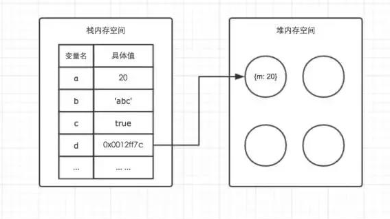

# 深浅拷贝

数据拷贝是 JavaScript 中常见的应用场景，JS 将数据分为基本数据类型和引用数据类型，由于引用数据类型特殊的存储机制，无法简单地通过赋值运算进行拷贝，因此出现了 **浅拷贝** 和 **深拷贝** 这两种不同的拷贝方式。

## JavaScript 存储机制

JS 将数据的存储划分为两个区域，**栈区（Stack）**和**堆区（Heap）**。

栈区用于存储 **基本数据类型的数据** 和 **引用数据类型数据的映射地址** ，映射地址指向堆区中 **引用数据类型数据** 实际的存储位置，堆区用于存储具体的 **引用数据类型数据**。



## 浅拷贝

浅拷贝能够实现基本的数据拷贝功能，但对于深层嵌套的引用数据，例如循环引用的情况，它无法进行有效的拷贝。

```js
const obj = {
	name: "吕威鹏",
	walk: function () {
		console.log("走路");
	},
};
obj.son = obj; // 循环引用

// 1-解构
const obj2 = { ...obj };
// 2-Object.assign()
const obj3 = Object.assign({}, obj);
// 3-序列化：无法克隆函数属性，循环引用会报错
const obj4 = JSON.parse(JSON.stringify(obj));
```

## 深拷贝

深拷贝是 JavaScript 中数据拷贝的终极解决方案。一个完美的深拷贝函数的实现相当复杂，下面为你提供一个相对完整的示例。

```js
const isObject = (data) => {
	return (
		data !== null && (typeof data === "object" || typeof data === "function")
	);
};

const deepClone = (value) => {
	const map = new WeakMap(); // 使用WeakMap记录已处理的数据

	function _deepClone(data) {
		// 1 ------基本数据类型 ------
		if (!isObject(data)) {
			return data;
		}
		// 2  ------引用数据类型 ------
		if (map.has(data)) {
			return map.get(data); // 已处理的数据直接返回
		}
		// 2-1 特殊类型
		if (data instanceof RegExp) {
			return new RegExp(data);
		}
		if (data instanceof Date) {
			return new Date(data.getTime());
		}
		if (data instanceof Function) {
			return data;
		}
		// 2-2 数组和对象
		const result = Array.isArray(data) ? [] : {};
		map.set(data, result); // 保存已处理的映射关系
		for (const key in data) {
			if (Object.prototype.hasOwnProperty.call(data, key)) {
				result[key] = _deepClone(data[key]);
			}
		}
		return result;
	}

	return _deepClone(value);
};
```

- WeakMap 和 Map 的区别
