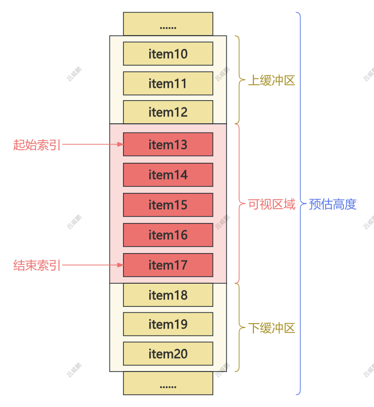

# 虚拟列表

## 1.什么是虚拟列表？

虚拟列表是前端解决大量数据渲染的优化技术，用于解决页面渲染大量数据时白屏时间过长、卡顿，甚至崩溃的问题。

## 2.实现原理及优化细节

虽然页面提供了大量数据的展示，但用户往往只能查看可视区域的数据，而渲染非可视区域的数据导致了性能的浪费，另外一个页面同时挂载几百个节点，会增加浏览器的渲染压力，导致页面卡顿，严重影响用户体验。

1.预估所有数据在页面所占的高度，通过设置占位元素高度撑起可视区域，目的是让可视区域出现滚动条，通过滚动条的位置让用户知道数据大概的量级。

2.根据用户滑动操作，动态计算可视区域应展示的数据内容，只渲染用户可视区域的内容，通过不断替换可视区域的节点，解决页面加载大量节点导致卡顿的问题。

3.由于真正展示的数据内容在用户滑动时才开始渲染，所以导致了用户滑动过快，浏览器渲染不及时，出现可视区域白屏闪屏的问题，于是在可视区域的上下增加缓冲区，额外准备一部分的数据给用户上下滑动时查看，为浏览器的渲染争取时间。



## 3.如何优雅且高性能地生成百万级数据？

```js
// 测试环境：Chrome 115 / Node.js 20
// 测试数据：生成100万个对象

// 方法1：Array.from().map()
console.time("Array.from + map");
const data1 = Array.from({ length: 1000000 }).map((_, i) => ({
	id: i,
	text: `Item ${i}`,
}));
console.timeEnd("Array.from + map"); // 约100-150ms

// 方法2：for循环 + push
console.time("for + push");
const data2 = [];
for (let i = 0; i < 1000000; i++) {
	data2.push({ id: i, text: `Item ${i}` });
}
console.timeEnd("for + push"); // 约80-120ms

// 方法3：预分配数组 + 索引赋值
console.time("for + pre-allocation");
const data3 = new Array(1000000);
for (let i = 0; i < 1000000; i++) {
	data3[i] = { id: i, text: `Item ${i}` };
}
console.timeEnd("for + pre-allocation"); // 约60-100ms（最快）
```

- 通过`Array.from()`转换`{ length: 1000000 }`的方式创建长度为 1000000 的数组，操作很花哨，但性能不如`new Array(1000000)`;
- `map()`是高阶函数，每次遍历都会执行传入的回调函数，这意味着 JS 会为`map()`创建一个函数栈，每次遍历时又会创建和销毁回调函数的函数栈，多余的开栈关栈操作导致了更多的性能开销，所以性能不如`for循环`中新增数组元素；
- `push()`的性能不如直接通过数组索引新增元素，且创建空数组再`push()`的方法，会在每次遍历中不断修改数组的`length`属性，带来额外的性能开销，故不如先分配预期长度的数组，性能更优。

## 4.核心代码

### 4-1 页面结构及样式

```html
<!-- 容器：可视区域 -->
<div id="container">
	<!-- 占位元素：提供虚拟高度 -->
	<div id="placeholder"></div>
	<!-- 列表：动态渲染的内容 -->
	<div id="list"></div>
</div>
```

```css
#container {
	position: relative;
	width: 800px;
	height: 80vh;
	overflow: scroll;
}

#placeholder {
	position: absolute;
	width: 100%;
}

#list {
	position: absolute;
	top: 0;
	left: 0;
	width: 100%;
}
```

- 容器元素需要固定宽高，`overflow-x: scroll` + 固定宽度出现横向滚动条（可用于表格超多列的情况），`overflow-y: scroll`固定高度出现竖向滚动条（可用于展示大量条数的数据），也可直接设置复合属性`overflow: scroll`
- 列表元素（动态渲染的内容）需相对于容器定位，配合`transform: translateY()`就能实现列表元素位置不变，仅内容向上平移的视觉效果

### 4-2 基础配置

```js
const itemHeight = 138; // 单条数据节点的高度
const bufferSize = 5; // 缓冲区的数据条数
```

- `itemHeight`可通过节点的`offsetHeight`获取

### 4-3 占位元素撑起可视区域

```js
placeholder.style.height = `${data.length * itemHeight}px`;
```

### 4-4 计算可视区域的起始和结束索引

```js
const scrollTop = container.scrollTop; // 容器的滚动距离
// 起始索引
const startIndex = Math.max(Math.floor(scrollTop / itemHeight) - bufferSize, 0);
// 结束索引
const endIndex = Math.min(
	Math.ceil((scrollTop + container.clientHeight) / itemHeight) + bufferSize,
	data.length
);
```

- 起始索引需减去上方缓冲区条数，结束索引需加上下缓冲区条数
- `Math.max()`确保起始索引不小于 0，`Math.min()`确保结束索引不超过数据总长度

### 4-5 计算需渲染的项目和内容偏移量

```js
// 计算需渲染的项目
const visibleItems = data.slice(startIndex, endIndex);

// 计算内容偏移量
const offsetTop = startIndex * itemHeight;
list.style.transform = `translateY(${offsetTop}px)`;
```

- 传统虚拟列表通过给单个项目设置定位，然后修改其`top`属性实现平移，会导致浏览器大量的`reflow`，消耗过多性能；而通过计算可视区域整体内容的偏移量，用`transform`整体平移，能大大节省浏览器渲染的开销。

### 4-6 渲染可见项目

```js
list.innerHTML = visibleItems
	.map((item, index) => {
		const realIndex = startIndex + index; // 计算实际索引
		return `<div class="item">
					<div>
						<span>${item.name}</span>
						<span>&nbsp;第 <b class='item-no'>${realIndex}</b> 号</span>
					</div>
					<div>${item.description}</div>
					<div class="item-company">${item.company}</div>
				</div>`;
	})
	.join("");
```

### 4-7 在不同事件中触发虚拟列表的渲染

```js
window.addEventListener("load", function () {
	data = getData(); // 模拟向后端获取数据
	render();
});
window.addEventListener("resize", render);
container.addEventListener("scroll", render);
```
